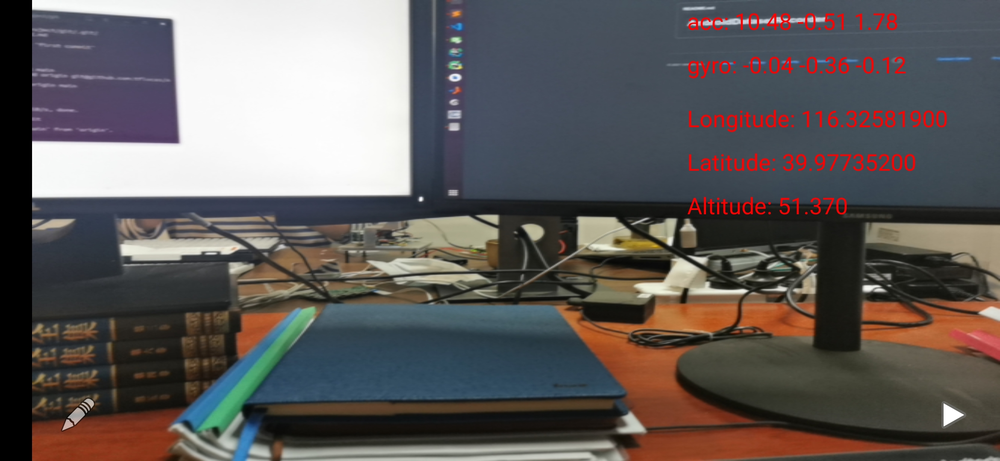
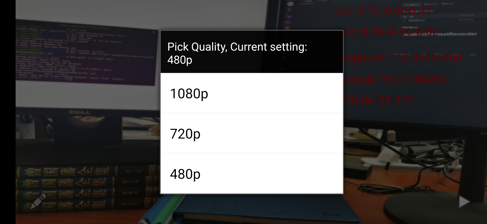
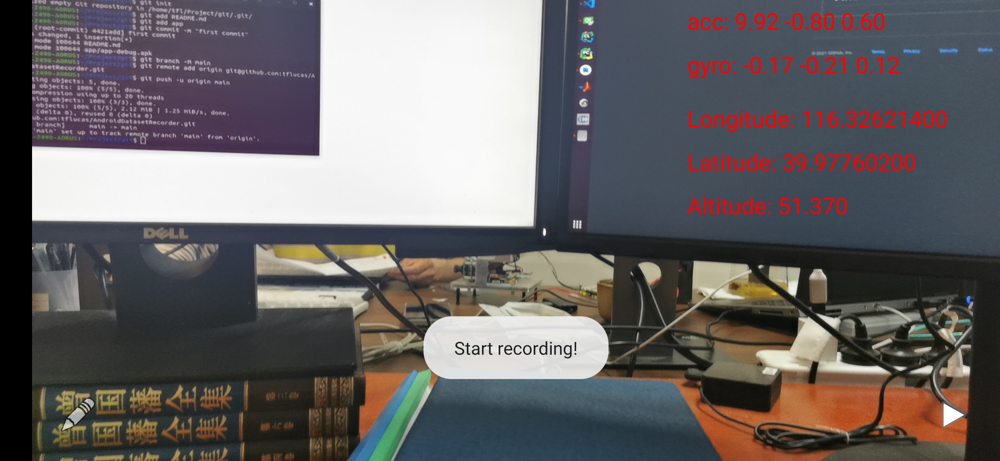

# AndroidDatasetRecorder

This app can record datasets directly on an android mobile device. 
For each recorded dataset, it is saved in the mobile device, containing gyro, acc, gravity, rotation vector, GPS(if GPS is available) and images.
The path is /Android/data/com.example.androiddatasetrecorder/files/AndroidDataRecorder.

# Features
1. Gyroscope(250hz)    
2. Acceleration(250hz)    
3. Gravity(100hz)  
4. Rotation Vector(100hz)  
5. GPS(if GPS is available)(1hz)  
6. images(25hz)  

# Layout
**1. The left button is for setting the resolution.**  
**2. The right button is for starting recording.**  
**3. Exiting the app means ending recording.**
  
  
  

